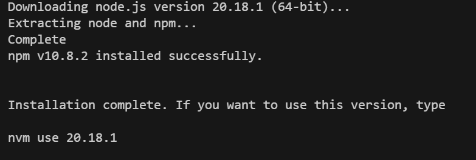
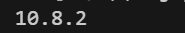

# front-end-learn-vue3
 学习和实践 Vue 3 前端框架

依赖库：

https://github.com/coreybutler/nvm-windows#readme

1. 安装好nvm。

2. 下载 node.js 版本为20。

   ```bash
   nvm install 20
   ```



3. 使用下载的版本

   ```bash
   nvm use 20.18.1
   ```


4. 查看版本信息

   ```
   npm -v 
   ```


